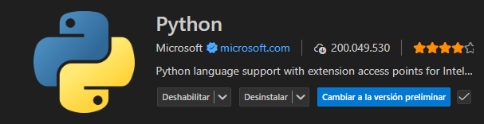

# Guía de Uso: Visual Studio Code (Python)

Visual Studio Code es un editor extensible que hemos configurado para trabajar con Python.

## 1. Instalación de Plugins
Para trabajar correctamente, he instalado la extensión oficial de **Python** de Microsoft.
* **Paso a paso:** Ir al icono de 'Extensions' (Ctrl+Shift+X), buscar "Python" y pulsar Install.
* **Captura recomendada:** 

## 2. Trabajo con Git
VS Code incluye integración nativa con Git para el control de versiones.
* **Paso a paso:** Abrir la pestaña 'Source Control' (icono de ramas), pulsar en 'Initialize Repository' y realizar un 'Commit' escribiendo un mensaje.
* **Captura recomendada:** [Aquí inserta tu foto del panel lateral de Git]

## 3. Uso del Debugger
El depurador permite analizar el flujo del programa y el valor de las variables.
* **Paso a paso:** Hacer clic a la izquierda del número de línea para poner un punto rojo (breakpoint). Pulsar F5 para iniciar la depuración y observar el panel 'Variables'.
* **Captura recomendada:** [Aquí inserta tu foto del código pausado en amarillo con variables a la izquierda]