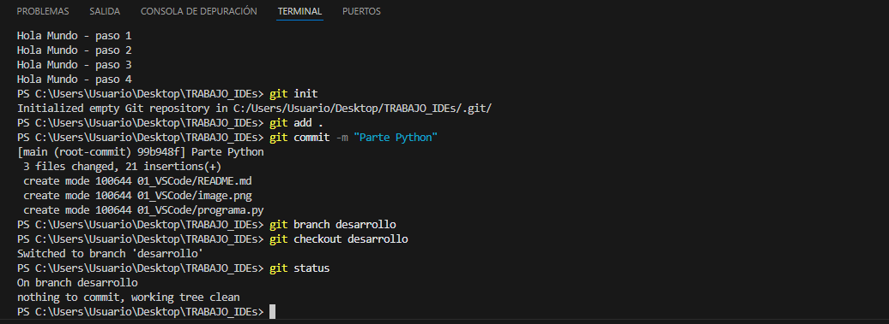
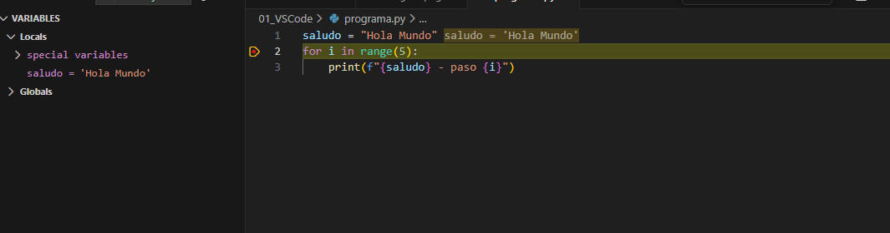

# Guía Técnica: Python en VS Code

## 1. Desarrollo y Control de Versiones (Git)
En este apartado he configurado el entorno para seguir un flujo de trabajo basado en ramas mediante la terminal.

**Comandos utilizados:**
- `git init`: Para iniciar el repositorio.
- `git add` y `git commit`: Para guardar los cambios.
- `git branch` y `git checkout`: Para gestionar la rama de 'desarrollo'.

## 2. Depuración del Código (Debugger)
He utilizado el depurador integrado para analizar el comportamiento del bucle y el estado de las variables en tiempo real.
- He colocado un **breakpoint** en la línea 2.
- He verificado que la variable `saludo` se asigna correctamente antes de entrar al bucle.

## 3. Extensiones Utilizadas
Para que este flujo funcione, he instalado la extensión oficial de **Python (Microsoft)** que permite tanto la ejecución como la depuración y el autocompletado.

