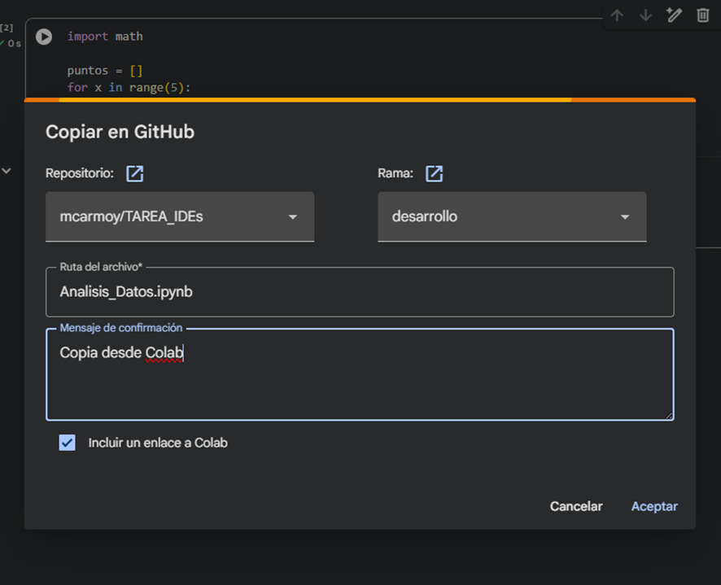
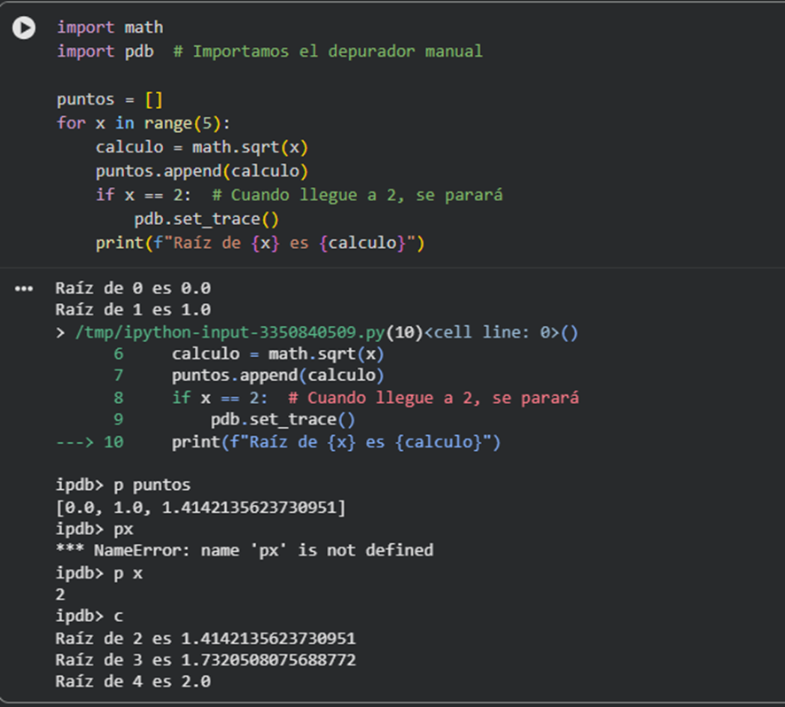

# Guía Técnica: Google Colab (Notebooks)

## 1. Integración y Control de Versiones (GitHub)
En este apartado he utilizado el entorno basado en la nube de Google Colab, integrándolo directamente con GitHub para el control de versiones sin necesidad de comandos locales.

**Acciones realizadas:**
- **Conexión remota:** Vinculación del cuaderno con el repositorio de la asignatura.
- **Sincronización:** Uso de la opción `Guardar una copia en GitHub` para generar commits directos desde la interfaz web.
- **Gestión de ramas:** Selección de la rama de 'desarrollo' para mantener el flujo de trabajo organizado.

## 2. Depuración del Código (Debugger pdb)
He utilizado el depurador interactivo de Python (`pdb`) para realizar una inspección técnica de los cálculos matemáticos dentro de un bucle.
- **Punto de interrupción:** He forzado la detención del programa en la iteración `x == 2` mediante el comando `pdb.set_trace()`.
- **Inspección de variables:** He verificado a través de la consola `ipdb` el estado de la lista `puntos` y el valor del cálculo de la raíz cuadrada en ese instante.

## 3. Características del Entorno
Para este flujo de trabajo no ha sido necesaria la instalación de extensiones manuales, ya que Google Colab ofrece un entorno preconfigurado con:
- **Librerías preinstaladas:** Soporte nativo para `math` y herramientas de análisis de datos.
- **Inspector de datos:** Panel lateral para monitorizar variables y estructuras complejas como listas y diccionarios.
