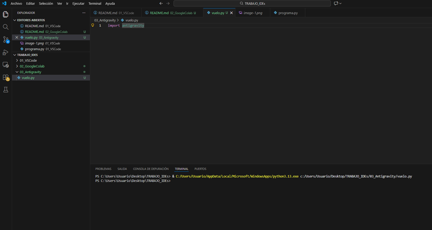
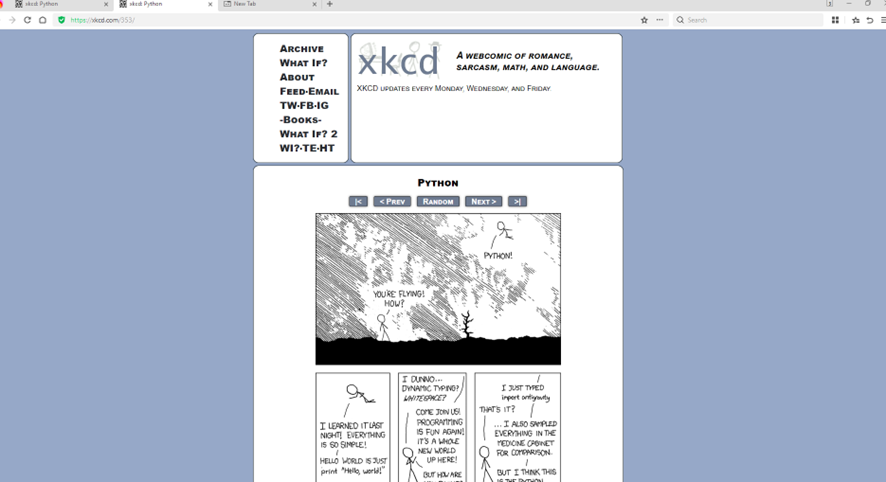

# Guía Técnica 3: Interoperabilidad y Scripts del Sistema (Antigravity)

En este tercer bloque he explorado la capacidad de Python para interactuar con componentes del sistema operativo y recursos externos mediante módulos nativos.

## 1. Ejecución de Scripts y Runtime
A diferencia de los entornos anteriores, aquí se ha comprobado cómo un script simple puede disparar eventos en el sistema (como abrir un navegador).

- **Módulo utilizado:** `antigravity` (módulo nativo de Python).
- **Proceso:** El intérprete procesa la instrucción y llama a la API del navegador predeterminado para cargar una URL específica.

## 2. El "Huevo de Pascua" Técnico
Este ejercicio demuestra la filosofía de Python: "Batteries Included" (Baterías incluidas), lo que significa que el lenguaje viene preparado con herramientas para casi cualquier tarea, incluso las humorísticas.

- **Comportamiento:** Se ha verificado que el IDE gestiona correctamente la apertura de procesos hijos (el navegador) sin bloquear la ejecución.
- **Resultado:** Visualización del cómic de XKCD que explica de forma técnica la simplicidad del lenguaje.

